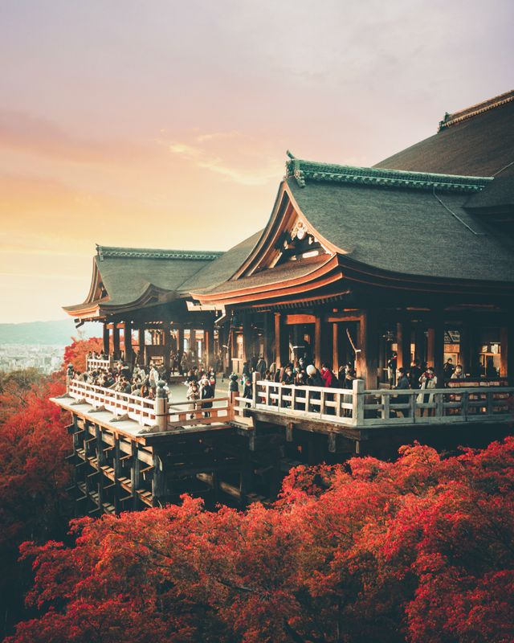

実行例
------

[このプログラム]をブラウザのブックマークのURL欄にコピーし、画像のあるwebページ上でそのブックマークを選ぶと、画面上の画像のうち一番大きいものが次のようなパズルに変換されます。

 
(Photo by [Sunil Poudel])

インストール方法
----------------

1. [このプログラム]の上部のコピーボタン(⧉のようなアイコン)を押して全体をコピーする。
2. ブラウザでブックマークを新規作成する。(Safariでは、適当なページで共有ボタンを押して、「ブックマークを追加」)
3. 作ったブックマークを編集。(Safariでは作ったブックマークを長押しして「編集」)
4. URL欄を空にして(または全選択して)、「ペースト」。

PC上のブラウザでは、このリンク([rotpuzzle])を(クリックするのではなく)ブックマークツールバーにドラッグすることでもインストールできます。

ブックマークレットに関する注意点
--------------------------------

このような方法で実行するプログラム(ブックマークレット)は、表示中のページ内のプログラムと同じ権限を持ちます。たとえば、パスワードなどの秘密の情報を扱うページで悪意あるブックマークレットを実行すると、その秘密情報を見られる可能性があります。ブックマークレットをインストールする際には、プログラムをAIに読ませるなどして、害の無いプログラムであることを確認しておくことをおすすめします。

バグ
----

特殊な画像の表示方法を採用しているサイトでは、動作しなかったり、画像とピースのサイズがずれたりする場合があります。特に、iframe内の画像や背景画像として表示されている画像に対しては動作しません。

Android上のChromeについて
-------------------------

Android端末のChromeはブックマークレットの文字数制限が厳しく、このプログラムは動作しません。代わりに[プログラム本体を外部サイトからロードするブックマークレット]を使って実行することができます。ただし、多くのサイト(Xなど)ではセキュリティの設定で外部サイトのプログラムのロードを許可していないので、動作するサイトは限られます。(また、上の注意点でおすすめしたこととも両立しません。)

なお、Androidではブックマークレットをブックマークメニューから実行できません。アドレス入力欄にブックマーク名を入力して、予測変換候補の中からブックマークを選択して実行してください。

[Sunil Poudel]: https://www.pexels.com/@spdel/highlights/
[このプログラム]: https://github.com/tooro88/rotpuzzle/blob/main/rotpuzzle.bookmarklet.js
[rotpuzzle]: javascript:(()%20=%3E%20%7B%0A%0Aconst%20ROTPUZZLE_VERSION%20=%20%220.1%22;%0Aconst%20DEFAULT_DIVISION%20=%206;%0Aconst%20DEFAULT_HAS_BORDER%20=%20true;%0Aconst%20BORDER_COLOR%20=%20%22#555%22;%0Aconst%20COVER_COLOR%20=%20%22#bbb%22;%0Aconst%20BUTTON_OPACITY%20=%200.7;%0Aconst%20TRANSITION_DURATION%20=%200.25;%0Aconst%20PIECE_FLASH_DURATION%20=%200.7;%0Aconst%20BOARD_FLASH_DURATION%20=%201.7;%0Aconst%20MARGIN_RATIO%20=%200.03;%0Aconst%20BORDER_RATIO%20=%200.01;%0Aconst%20BORDER_MIN_PX%20=%201;%0Aconst%20MAX_PIECES%20=%209999;%0Aconst%20MAX_DIVISION%20=%2099;%0Aconst%20ICON_SIZE%20=%2070;%0Aconst%20PIECE_MARGIN_PX%20=%201;%0Aconst%20CLICK_THRESHOLD%20=%204;%0A%0Aconst%20MAX_Z%20=%202147483647;%0Aconst%20BIG_Z%20=%20MAX_Z%20-%2010;%0Aconst%20COVER_Z%20=%200;%0Aconst%20PIECE_Z%20=%201;%0Aconst%20hexCoords%20=%20%5B%20%5B-1%2C%200%5D%2C%20%5B-0.5%2C%20%201%5D%2C%20%5B%200.5%2C%20%201%5D%2C%0A%20%20%20%20%20%20%20%20%20%20%20%20%20%20%20%20%20%20%20%20%5B%201%2C%200%5D%2C%20%5B%200.5%2C%20-1%5D%2C%20%5B-0.5%2C%20-1%5D%20%5D;%0A%0Aclass%20Puzzle%20%7B%0A%20%20%20%20constructor(img%2C%20division%2C%20hasBorder)%20%7B%0A%20%20%20%20%20%20%20%20this.img%20=%20img;%0A%20%20%20%20%20%20%20%20this.division%20=%20division;%0A%20%20%20%20%20%20%20%20this.raisedPieces%20=%20%5B%5D;%0A%20%20%20%20%20%20%20%20this.maxDivision%20=%20MAX_DIVISION;%0A%20%20%20%20%20%20%20%20this.hasBorder%20=%20hasBorder;%0A%20%20%20%20%20%20%20%20this.rotatingPiece%20=%20null;%0A%20%20%20%20%20%20%20%20this.draggingPiece%20=%20null;%0A%20%20%20%20%7D%0A%20%20%20%20startUI()%20%7B%0A%20%20%20%20%20%20%20%20if%20(%21this.img)%20return%20%22no%20image%22;%0A%20%20%20%20%20%20%20%20this.geom%20=%20getImageGeometry(this.img);%0A%20%20%20%20%20%20%20%20this.imageRect%20=%20this.geom.imageRect;%0A%20%20%20%20%20%20%20%20const%20screenRect%20=%20getScreenRect();%0A%20%20%20%20%20%20%20%20const%20vr%20=%20this.img.classList.contains(%22rotpuzzle-target%22)%0A%20%20%20%20%20%20%20%20%20%20%20%20%20%20%20%20%20%20%20?%20this.geom.viewRect%0A%20%20%20%20%20%20%20%20%20%20%20%20%20%20%20%20%20%20%20:%20intersection(screenRect%2C%20this.geom.viewRect);%0A%20%20%20%20%20%20%20%20if%20(vr.width%20%3C=%200%20%7C%7C%20vr.height%20%3C=%200)%20return%20%22image%20too%20small%22;%0A%0A%20%20%20%20%20%20%20%20const%20short%20=%20Math.min(vr.width%2C%20vr.height);%0A%20%20%20%20%20%20%20%20const%20minMargin%20=%20short%20%2A%20MARGIN_RATIO;%0A%20%20%20%20%20%20%20%20this.calcSizes(vr.width%20%20-%20minMargin%20%2A%202%2C%0A%20%20%20%20%20%20%20%20%20%20%20%20%20%20%20%20%20%20%20%20%20%20%20vr.height%20-%20minMargin%20%2A%202);%0A%20%20%20%20%20%20%20%20if%20(this.size%20%3C%20BORDER_MIN_PX%20%2A%2010)%20return%20%22image%20too%20small%22;%0A%0A%20%20%20%20%20%20%20%20const%20px%20=%20(vr.width%20%20-%20this.puzzleWidth)%20%20/%202;%0A%20%20%20%20%20%20%20%20const%20py%20=%20(vr.height%20-%20this.puzzleHeight)%20/%202;%0A%20%20%20%20%20%20%20%20this.imageOffsetX%20=%20this.imageRect.left%20-%20(vr.left%20%2B%20px);%0A%20%20%20%20%20%20%20%20this.imageOffsetY%20=%20this.imageRect.top%20%20-%20(vr.top%20%20%2B%20py);%0A%20%20%20%20%20%20%20%20this.root%20=%20this.createRootPane(vr);%0A%20%20%20%20%20%20%20%20this.puzzle%20=%20this.createPuzzlePane(px%2C%20py);%0A%20%20%20%20%20%20%20%20this.pieceMargin%20=%20this.hasBorder%20?%20PIECE_MARGIN_PX%20:%200;%0A%0A%20%20%20%20%20%20%20%20this.pieces%20=%20%5B%5D;%0A%20%20%20%20%20%20%20%20this.posns%20=%20%5B%5D;%0A%20%20%20%20%20%20%20%20for%20(const%20pos%20of%20this.genPiecePositions())%20%7B%0A%20%20%20%20%20%20%20%20%20%20%20%20const%20idx%20=%20this.posns.length;%0A%20%20%20%20%20%20%20%20%20%20%20%20this.posns.push(pos);%0A%20%20%20%20%20%20%20%20%20%20%20%20const%20piece%20=%20this.createPiece(idx);%0A%20%20%20%20%20%20%20%20%7D%0A%20%20%20%20%20%20%20%20if%20(this.pieces.length%20%3E%20MAX_PIECES)%0A%20%20%20%20%20%20%20%20%20%20%20%20return%20%22too%20many%20pieces%22;%0A%0A%20%20%20%20%20%20%20%20document.body.appendChild(this.root);%0A%20%20%20%20%20%20%20%20const%20panel%20=%20this.createUIPanel();%0A%20%20%20%20%20%20%20%20this.removeHiddenPieces(panel);%0A%20%20%20%20%20%20%20%20this.alives%20=%20%5B...this.pieces%5D;%0A%20%20%20%20%20%20%20%20for%20(const%20p%20of%20this.pieces)%20%7B%0A%20%20%20%20%20%20%20%20%20%20%20%20this.drawPiece(p%2C%20true);%0A%20%20%20%20%20%20%20%20%7D%0A%20%20%20%20%20%20%20%20this.shuffle();%0A%20%20%20%20%20%20%20%20this.history%20=%20%5B%5D;%0A%20%20%20%20%20%20%20%20return%20null;%0A%20%20%20%20%7D%0A%20%20%20%20createRootPane(vr)%20%7B%0A%20%20%20%20%20%20%20%20const%20root%20=%20document.createElement(%22div%22);%0A%20%20%20%20%20%20%20%20root.className%20=%20%22rotpuzzle-root%22;%0A%20%20%20%20%20%20%20%20const%20rx%20=%20vr.left%20%2B%20window.scrollX;%0A%20%20%20%20%20%20%20%20const%20ry%20=%20vr.top%20%20%2B%20window.scrollY;%0A%20%20%20%20%20%20%20%20Object.assign(root.style%2C%20%7B%0A%20%20%20%20%20%20%20%20%20%20%20%20position:%20%22absolute%22%2C%0A%20%20%20%20%20%20%20%20%20%20%20%20left:%20%60%24%7Brx%7Dpx%60%2C%0A%20%20%20%20%20%20%20%20%20%20%20%20top:%20%20%60%24%7Bry%7Dpx%60%2C%0A%20%20%20%20%20%20%20%20%20%20%20%20width:%20%20%60%24%7Bvr.width%7Dpx%60%2C%0A%20%20%20%20%20%20%20%20%20%20%20%20height:%20%60%24%7Bvr.height%7Dpx%60%2C%0A%20%20%20%20%20%20%20%20%20%20%20%20zIndex:%20BIG_Z%2C%0A%20%20%20%20%20%20%20%20%20%20%20%20touchAction:%20%22none%22%2C%0A%20%20%20%20%20%20%20%20%20%20%20%20userSelect:%20%22none%22%2C%0A%20%20%20%20%20%20%20%20%7D);%0A%20%20%20%20%20%20%20%20for%20(const%20name%20of%20%20%5B%27mousedown%27%2C%20%27mouseup%27%2C%20%27click%27%2C%20%27dblclick%27%2C%0A%20%20%20%20%20%20%20%20%20%20%20%20%20%20%20%20%20%20%20%20%20%20%20%20%20%20%20%20%20%27touchstart%27%2C%20%27touchmove%27%2C%0A%20%20%20%20%20%20%20%20%20%20%20%20%20%20%20%20%20%20%20%20%20%20%20%20%20%20%20%20%20%27touchend%27%2C%20%27touchcancel%27%2C%0A%20%20%20%20%20%20%20%20%20%20%20%20%20%20%20%20%20%20%20%20%20%20%20%20%20%20%20%20%20%27pointermove%27%2C%20%27pointercancel%27%2C%0A%20%20%20%20%20%20%20%20%20%20%20%20%20%20%20%20%20%20%20%20%20%20%20%20%20%20%20%20%20%27contextmenu%27%2C%20%20%27pointerdown%27%2C%20%27pointerup%27%2C%5D)%20%7B%0A%20%20%20%20%20%20%20%20%20%20%20%20root.addEventListener(name%2C%20(e)%20=%3E%20%7B%0A%20%20%20%20%20%20%20%20%20%20%20%20%20%20%20%20if%20(e.target.closest(%27.rotpuzzle-ui%27))%0A%20%20%20%20%20%20%20%20%20%20%20%20%20%20%20%20%20%20%20%20return;%0A%20%20%20%20%20%20%20%20%20%20%20%20%20%20%20%20e.preventDefault();%0A%20%20%20%20%20%20%20%20%20%20%20%20%20%20%20%20e.stopPropagation();%0A%20%20%20%20%20%20%20%20%20%20%20%20%7D%2C%20%7B%20passive:%20false%20%7D);%0A%20%20%20%20%20%20%20%20%7D%0A%20%20%20%20%20%20%20%20return%20root;%0A%20%20%20%20%7D%0A%20%20%20%20createPuzzlePane(x%2C%20y)%20%7B%0A%20%20%20%20%20%20%20%20const%20puzzle%20=%20document.createElement(%22div%22);%0A%20%20%20%20%20%20%20%20Object.assign(puzzle.style%2C%20%7B%0A%20%20%20%20%20%20%20%20%20%20%20%20position:%20%22absolute%22%2C%0A%20%20%20%20%20%20%20%20%20%20%20%20left:%20%60%24%7Bx%7Dpx%60%2C%0A%20%20%20%20%20%20%20%20%20%20%20%20top:%20%20%60%24%7By%7Dpx%60%2C%0A%20%20%20%20%20%20%20%20%20%20%20%20width:%20%20%60%24%7Bthis.puzzleWidth%7Dpx%60%2C%0A%20%20%20%20%20%20%20%20%20%20%20%20height:%20%60%24%7Bthis.puzzleHeight%7Dpx%60%2C%0A%20%20%20%20%20%20%20%20%7D);%0A%20%20%20%20%20%20%20%20this.root.appendChild(puzzle);%0A%20%20%20%20%20%20%20%20return%20puzzle;%0A%20%20%20%20%7D%0A%20%20%20%20calcSizes(w%2C%20h)%20%7B%0A%20%20%20%20%20%20%20%20const%20short%20=%20Math.min(w%2C%20h);%0A%20%20%20%20%20%20%20%20const%20long%20%20=%20Math.max(w%2C%20h);%0A%20%20%20%20%20%20%20%20const%20size%20=%20short%20/%20this.division;%0A%20%20%20%20%20%20%20%20this.borderPx%20=%20Math.max(size%20%2A%20BORDER_RATIO%2C%20BORDER_MIN_PX);%0A%20%20%20%20%20%20%20%20const%20longCount%20=%20Math.floor(long%20/%20size);%0A%20%20%20%20%20%20%20%20const%20puzzleShort%20=%20size%20%2A%20this.division;%0A%20%20%20%20%20%20%20%20const%20puzzleLong%20=%20size%20%2A%20longCount;%0A%0A%20%20%20%20%20%20%20%20if%20(w%20%3E=%20h)%20%7B%0A%20%20%20%20%20%20%20%20%20%20%20%20this.puzzleWidth%20=%20puzzleLong;%0A%20%20%20%20%20%20%20%20%20%20%20%20this.puzzleHeight%20=%20puzzleShort;%0A%20%20%20%20%20%20%20%20%20%20%20%20this.rows%20=%20this.division;%0A%20%20%20%20%20%20%20%20%20%20%20%20this.cols%20=%20longCount;%0A%20%20%20%20%20%20%20%20%7D%20else%20%7B%0A%20%20%20%20%20%20%20%20%20%20%20%20this.puzzleWidth%20=%20puzzleShort;%0A%20%20%20%20%20%20%20%20%20%20%20%20this.puzzleHeight%20=%20puzzleLong;%0A%20%20%20%20%20%20%20%20%20%20%20%20this.rows%20=%20longCount;%0A%20%20%20%20%20%20%20%20%20%20%20%20this.cols%20=%20this.division;%0A%20%20%20%20%20%20%20%20%7D%0A%20%20%20%20%20%20%20%20this.size%20=%20size;%0A%20%20%20%20%20%20%20%20this.hRatio%20=%201;%0A%20%20%20%20%20%20%20%20this.vRatio%20=%201;%0A%20%20%20%20%20%20%20%20this.vStep%20=%20this.size;%0A%20%20%20%20%20%20%20%20this.hStep%20=%20this.size;%0A%20%20%20%20%7D%0A%20%20%20%20%2AgenPiecePositions()%20%7B%0A%20%20%20%20%20%20%20%20for%20(let%20row%20=%200;%20row%20%3C%20this.rows;%20row%2B%2B)%20%7B%0A%20%20%20%20%20%20%20%20%20%20%20%20for%20(let%20col%20=%200;%20col%20%3C%20this.cols;%20col%2B%2B)%20%7B%0A%20%20%20%20%20%20%20%20%20%20%20%20%20%20%20%20yield%20%5Bcol%2C%20row%5D;%0A%20%20%20%20%20%20%20%20%20%20%20%20%7D%0A%20%20%20%20%20%20%20%20%7D%0A%20%20%20%20%7D%0A%20%20%20%20showAnswer()%20%7B%0A%20%20%20%20%20%20%20%20this.rotatingPiece%20=%20null;%0A%20%20%20%20%20%20%20%20for%20(const%20piece%20of%20this.alives)%20%7B%0A%20%20%20%20%20%20%20%20%20%20%20%20this.setPieceIdx(piece%2C%20piece.correctIdx);%0A%20%20%20%20%20%20%20%20%20%20%20%20piece.rotation%20=%200;%0A%20%20%20%20%20%20%20%20%20%20%20%20piece.rotated%20=%20false;%0A%20%20%20%20%20%20%20%20%20%20%20%20jumpPiece(piece);%0A%20%20%20%20%20%20%20%20%7D%0A%20%20%20%20%7D%0A%20%20%20%20shuffle()%20%7B%0A%20%20%20%20%20%20%20%20const%20idxs%20=%20this.alives.map(piece%20=%3E%20piece.correctIdx);%0A%0A%20%20%20%20%20%20%20%20const%20deg%20=%20this.rotationDegree();%0A%20%20%20%20%20%20%20%20const%20n%20=%20360%20/%20deg;%0A%20%20%20%20%20%20%20%20const%20order%20=%20derange(this.alives.length);%0A%20%20%20%20%20%20%20%20this.alives.forEach((piece%2C%20i)%20=%3E%20%7B%0A%20%20%20%20%20%20%20%20%20%20%20%20const%20idx%20=%20idxs%5Border%5Bi%5D%5D;%0A%20%20%20%20%20%20%20%20%20%20%20%20this.setPieceIdx(piece%2C%20idx);%0A%20%20%20%20%20%20%20%20%20%20%20%20piece.rotation%20=%20Math.floor(Math.random()%20%2A%20n)%20%2A%20deg;%0A%20%20%20%20%20%20%20%20%20%20%20%20piece.rotated%20=%20false;%0A%20%20%20%20%20%20%20%20%20%20%20%20jumpPiece(piece);%0A%20%20%20%20%20%20%20%20%7D);%0A%20%20%20%20%20%20%20%20if%20(this.alives.length%20===%201%20&&%20isCorrect(this.alives%5B0%5D))%20%7B%0A%20%20%20%20%20%20%20%20%20%20%20%20const%20p%20=%20this.alives%5B0%5D;%0A%20%20%20%20%20%20%20%20%20%20%20%20p.rotation%20=%20Math.floor(Math.random()%20%2A%20(n%20-%201))%20%2A%20deg%20%2B%20deg;%0A%20%20%20%20%20%20%20%20%20%20%20%20jumpPiece(p);%0A%20%20%20%20%20%20%20%20%7D%0A%20%20%20%20%7D%0A%20%20%20%20createPiece(idx)%20%7B%0A%20%20%20%20%20%20%20%20const%20piece%20=%20%7B%0A%20%20%20%20%20%20%20%20%20%20%20%20correctIdx:%20idx%2C%0A%20%20%20%20%20%20%20%20%20%20%20%20rotation:%200%2C%0A%20%20%20%20%20%20%20%20%20%20%20%20rotated:%20false%2C%0A%20%20%20%20%20%20%20%20%20%20%20%20el:%20null%2C%0A%20%20%20%20%20%20%20%20%20%20%20%20cover:%20null%2C%0A%20%20%20%20%20%20%20%20%7D;%0A%20%20%20%20%20%20%20%20this.setPieceIdx(piece%2C%20idx);%0A%20%20%20%20%20%20%20%20return%20piece;%0A%20%20%20%20%7D%0A%20%20%20%20drawPiece(piece%2C%20alive)%20%7B%0A%20%20%20%20%20%20%20%20if%20(piece.el)%0A%20%20%20%20%20%20%20%20%20%20%20%20piece.el.remove();%0A%20%20%20%20%20%20%20%20if%20(piece.cover)%0A%20%20%20%20%20%20%20%20%20%20%20%20piece.cover.remove();%0A%20%20%20%20%20%20%20%20%5Bpiece.el%2C%20piece.cover%5D%20=%20this.createPieceNode(piece);%0A%20%20%20%20%20%20%20%20if%20(alive)%20%7B%0A%20%20%20%20%20%20%20%20%20%20%20%20this.puzzle.appendChild(piece.cover);%0A%20%20%20%20%20%20%20%20%20%20%20%20this.puzzle.appendChild(piece.el);%0A%20%20%20%20%20%20%20%20%7D%0A%20%20%20%20%20%20%20%20Object.assign(piece.cover.style%2C%20%7B%0A%20%20%20%20%20%20%20%20%20%20%20%20background:%20COVER_COLOR%2C%0A%20%20%20%20%20%20%20%20%20%20%20%20zIndex:%20COVER_Z%2C%0A%20%20%20%20%20%20%20%20%7D);%0A%20%20%20%20%20%20%20%20Object.assign(piece.el.style%2C%20%7B%0A%20%20%20%20%20%20%20%20%20%20%20%20cursor:%20%22grab%22%2C%0A%20%20%20%20%20%20%20%20%20%20%20%20zIndex:%20PIECE_Z%2C%0A%20%20%20%20%20%20%20%20%7D);%0A%20%20%20%20%20%20%20%20piece.el.addEventListener(%22pointerdown%22%2C%20e%20=%3E%20%7B%0A%20%20%20%20%20%20%20%20%20%20%20%20this.beginDrag(piece%2C%20e);%0A%20%20%20%20%20%20%20%20%7D);%0A%20%20%20%20%20%20%20%20piece.el.addEventListener(%22contextmenu%22%2C%20e%20=%3E%20%7B%0A%20%20%20%20%20%20%20%20%20%20%20%20e.preventDefault();%0A%20%20%20%20%20%20%20%20%7D);%0A%20%20%20%20%20%20%20%20piece.el.addEventListener(%22transitionend%22%2C%20e%20=%3E%20%7B%0A%20%20%20%20%20%20%20%20%20%20%20%20this.onTransitionEnd(piece%2C%20e);%0A%20%20%20%20%20%20%20%20%7D);%0A%20%20%20%20%20%20%20%20piece.cover.dataset.pieceIdx%20=%20piece.correctIdx;%0A%20%20%20%20%7D%0A%20%20%20%20setPieceIdx(piece%2C%20idx)%20%7B%0A%20%20%20%20%20%20%20%20piece.idx%20=%20idx;%0A%20%20%20%20%20%20%20%20this.pieces%5Bidx%5D%20=%20piece;%0A%20%20%20%20%20%20%20%20const%20pos%20=%20this.posns%5Bidx%5D;%0A%20%20%20%20%20%20%20%20this.setPiecePos(piece%2C%20...pos);%0A%20%20%20%20%7D%0A%20%20%20%20setPiecePos(piece%2C%20col%2C%20row)%20%7B%0A%20%20%20%20%20%20%20%20const%20left%20=%20col%20%2A%20this.hStep;%0A%20%20%20%20%20%20%20%20const%20top%20%20=%20row%20%2A%20this.vStep;%0A%20%20%20%20%20%20%20%20piece.left%20=%20left%20-%20this.pieceMargin%20%2A%20this.hRatio;%0A%20%20%20%20%20%20%20%20piece.top%20%20=%20top%20%20-%20this.pieceMargin%20%2A%20this.vRatio;%0A%20%20%20%20%20%20%20%20piece.cx%20=%20left%20%2B%20this.size%20%2A%20this.hRatio%20/%202;%0A%20%20%20%20%20%20%20%20piece.cy%20=%20top%20%20%2B%20this.size%20%2A%20this.vRatio%20/%202;%0A%20%20%20%20%7D%0A%20%20%20%20createPieceNode(piece)%20%7B%0A%20%20%20%20%20%20%20%20const%20size%20=%20this.size;%0A%20%20%20%20%20%20%20%20const%20border%20=%20this.borderPx;%0A%20%20%20%20%20%20%20%20const%20ir%20=%20this.imageRect;%0A%20%20%20%20%20%20%20%20const%20%5Bx%2C%20y%5D%20=%20this.correctPos(piece);%0A%20%20%20%20%20%20%20%20const%20url%20=%20this.img.currentSrc;%0A%0A%20%20%20%20%20%20%20%20const%20b%20=%20this.hasBorder%20?%20this.borderPx%20:%200;%0A%20%20%20%20%20%20%20%20const%20m%20=%20this.pieceMargin;%0A%20%20%20%20%20%20%20%20const%20outerSize%20=%20this.size%20%2B%20m%20%2A%202;%0A%20%20%20%20%20%20%20%20const%20innerSize%20=%20this.size%20-%20b%20%2A%202;%0A%0A%20%20%20%20%20%20%20%20const%20ix%20=%20(m%20%2B%20b)%20%2A%20this.hRatio;%0A%20%20%20%20%20%20%20%20const%20iy%20=%20(m%20%2B%20b)%20%2A%20this.vRatio;%0A%20%20%20%20%20%20%20%20const%20bx%20=%20this.imageOffsetX%20-%20(x%20%2B%20ix);%0A%20%20%20%20%20%20%20%20const%20by%20=%20this.imageOffsetY%20-%20(y%20%2B%20iy);%0A%20%20%20%20%20%20%20%20const%20baseNode%20%20=%20this.createPieceShape(x%2C%20y%2C%20outerSize);%0A%20%20%20%20%20%20%20%20const%20coverNode%20=%20this.createPieceShape(x%2C%20y%2C%20outerSize);%0A%20%20%20%20%20%20%20%20let%20inner;%0A%20%20%20%20%20%20%20%20if%20(this.hasBorder)%20%7B%0A%20%20%20%20%20%20%20%20%20%20%20%20inner%20=%20this.createPieceShape(ix%2C%20iy%2C%20innerSize);%0A%20%20%20%20%20%20%20%20%20%20%20%20inner.style.pointerEvents%20=%20%22none%22;%0A%20%20%20%20%20%20%20%20%20%20%20%20baseNode.appendChild(inner);%0A%20%20%20%20%20%20%20%20%20%20%20%20baseNode.style.background%20=%20BORDER_COLOR;%0A%20%20%20%20%20%20%20%20%7D%20else%20%7B%0A%20%20%20%20%20%20%20%20%20%20%20%20inner%20=%20baseNode;%0A%20%20%20%20%20%20%20%20%7D%0A%20%20%20%20%20%20%20%20Object.assign(inner.style%2C%20%7B%0A%20%20%20%20%20%20%20%20%20%20%20%20backgroundImage:%20%60url(%22%24%7Burl%7D%22)%60%2C%0A%20%20%20%20%20%20%20%20%20%20%20%20backgroundSize:%20%60%24%7Bir.width%7Dpx%20%24%7Bir.height%7Dpx%60%2C%0A%20%20%20%20%20%20%20%20%20%20%20%20backgroundPosition:%20%60%24%7Bbx%7Dpx%20%24%7Bby%7Dpx%60%2C%0A%20%20%20%20%20%20%20%20%7D);%0A%20%20%20%20%20%20%20%20return%20%5BbaseNode%2C%20coverNode%5D;%0A%20%20%20%20%7D%0A%20%20%20%20createPieceShape(x%2C%20y%2C%20size)%20%7B%0A%20%20%20%20%20%20%20%20const%20node%20=%20document.createElement(%22div%22);%0A%20%20%20%20%20%20%20%20Object.assign(node.style%2C%20%7B%0A%20%20%20%20%20%20%20%20%20%20%20%20position:%20%22absolute%22%2C%0A%20%20%20%20%20%20%20%20%20%20%20%20left:%20%60%24%7Bx%7Dpx%60%2C%0A%20%20%20%20%20%20%20%20%20%20%20%20top:%20%20%60%24%7By%7Dpx%60%2C%0A%20%20%20%20%20%20%20%20%20%20%20%20width:%20%20%60%24%7Bsize%7Dpx%60%2C%0A%20%20%20%20%20%20%20%20%20%20%20%20height:%20%60%24%7Bsize%7Dpx%60%2C%0A%20%20%20%20%20%20%20%20%7D);%0A%20%20%20%20%20%20%20%20return%20node;%0A%20%20%20%20%7D%0A%20%20%20%20correctPos(piece)%20%7B%0A%20%20%20%20%20%20%20%20const%20pos%20=%20this.posns%5Bpiece.correctIdx%5D;%0A%20%20%20%20%20%20%20%20const%20dummy%20=%20%7B%7D;%0A%20%20%20%20%20%20%20%20this.setPiecePos(dummy%2C%20...pos);%0A%20%20%20%20%20%20%20%20return%20%5Bdummy.left%2C%20dummy.top%5D;%0A%20%20%20%20%7D%0A%20%20%20%20findOtherPiece(piece%2C%20x%2C%20y)%20%7B%0A%20%20%20%20%20%20%20%20const%20pr%20=%20this.puzzle.getBoundingClientRect();%0A%20%20%20%20%20%20%20%20const%20sx%20=%20x%20%2B%20pr.left;%0A%20%20%20%20%20%20%20%20const%20sy%20=%20y%20%2B%20pr.top;%0A%20%20%20%20%20%20%20%20for%20(const%20el%20of%20document.elementsFromPoint(sx%2C%20sy))%20%7B%0A%20%20%20%20%20%20%20%20%20%20%20%20if%20(el%20===%20this.puzzle)%20break;%0A%20%20%20%20%20%20%20%20%20%20%20%20if%20(%21(%22pieceIdx%22%20in%20el.dataset))%20continue;%0A%20%20%20%20%20%20%20%20%20%20%20%20const%20idx%20=%20Number(el.dataset.pieceIdx);%0A%20%20%20%20%20%20%20%20%20%20%20%20const%20p%20=%20this.pieces%5Bidx%5D;%0A%20%20%20%20%20%20%20%20%20%20%20%20return%20p%20===%20piece%20?%20null%20:%20p;%0A%20%20%20%20%20%20%20%20%7D%0A%20%20%20%20%20%20%20%20return%20null;%0A%20%20%20%20%7D%0A%20%20%20%20onTransitionEnd(piece%2C%20ev)%20%7B%0A%20%20%20%20%20%20%20%20this.checkAnswer(piece);%0A%20%20%20%20%7D%0A%20%20%20%20beginDrag(piece%2C%20e)%20%7B%0A%20%20%20%20%20%20%20%20if%20(this.rotatingPiece%20===%20piece%20&&%20isCorrect(piece))%0A%20%20%20%20%20%20%20%20%20%20%20%20/%2A%20avoid%20canceling%20previous%20transition%20who%20calls%20checkAnswer()%20%2A/%0A%20%20%20%20%20%20%20%20%20%20%20%20return;%0A%20%20%20%20%20%20%20%20if%20(e.button%20%21==%200%20&&%20e.button%20%21==%202)%20return;%0A%20%20%20%20%20%20%20%20e.preventDefault();%0A%20%20%20%20%20%20%20%20piece.el.setPointerCapture(e.pointerId);%0A%20%20%20%20%20%20%20%20this.draggingPiece%20=%20piece;%0A%0A%20%20%20%20%20%20%20%20const%20%5BstartX%2C%20startY%5D%20=%20%5Be.clientX%2C%20e.clientY%5D;%0A%20%20%20%20%20%20%20%20const%20%5BstartLeft%2C%20startTop%5D%20=%20%5Bpiece.left%2C%20piece.top%5D;%0A%20%20%20%20%20%20%20%20const%20%5BstartCx%2C%20startCy%5D%20=%20%5Bpiece.cx%2C%20piece.cy%5D;%0A%20%20%20%20%20%20%20%20let%20moved%20=%20false;%0A%20%20%20%20%20%20%20%20this.lowerPieces();%0A%20%20%20%20%20%20%20%20piece.el.style.zIndex%20=%20BIG_Z;%0A%0A%20%20%20%20%20%20%20%20piece.el.style.transition%20=%20%60transform%20%24%7BTRANSITION_DURATION%7Ds%20ease%60;%0A%20%20%20%20%20%20%20%20piece.el.style.cursor%20=%20%22grabbing%22;%0A%0A%20%20%20%20%20%20%20%20const%20move%20=%20e%20=%3E%20%7B%0A%20%20%20%20%20%20%20%20%20%20%20%20const%20dx%20=%20e.clientX%20-%20startX;%0A%20%20%20%20%20%20%20%20%20%20%20%20const%20dy%20=%20e.clientY%20-%20startY;%0A%20%20%20%20%20%20%20%20%20%20%20%20const%20new_left%20=%20startLeft%20%2B%20dx;%0A%20%20%20%20%20%20%20%20%20%20%20%20const%20new_top%20%20=%20startTop%20%2B%20dy;%0A%20%20%20%20%20%20%20%20%20%20%20%20piece.el.style.left%20=%20%60%24%7Bnew_left%7Dpx%60;%0A%20%20%20%20%20%20%20%20%20%20%20%20piece.el.style.top%20=%20%60%24%7Bnew_top%7Dpx%60;%0A%20%20%20%20%20%20%20%20%20%20%20%20if%20(%21moved%20&&%20Math.abs(dx)%20%2B%20Math.abs(dy)%20%3C=%20CLICK_THRESHOLD)%0A%20%20%20%20%20%20%20%20%20%20%20%20%20%20%20%20return;%0A%0A%20%20%20%20%20%20%20%20%20%20%20%20moved%20=%20true;%0A%20%20%20%20%20%20%20%20%20%20%20%20this.rotatingPiece%20=%20null;%0A%20%20%20%20%20%20%20%20%20%20%20%20const%20%5Bcx%2C%20cy%5D%20=%20%5BstartCx%20%2B%20dx%2C%20startCy%20%2B%20dy%5D;%0A%20%20%20%20%20%20%20%20%20%20%20%20const%20target%20=%20this.findOtherPiece(piece%2C%20cx%2C%20cy);%0A%20%20%20%20%20%20%20%20%20%20%20%20if%20(%21target)%20return;%0A%20%20%20%20%20%20%20%20%20%20%20%20this.swapPieces(piece%2C%20target);%0A%20%20%20%20%20%20%20%20%7D;%0A%0A%20%20%20%20%20%20%20%20const%20end%20=%20e%20=%3E%20%7B%0A%20%20%20%20%20%20%20%20%20%20%20%20piece.el.releasePointerCapture(e.pointerId);%0A%20%20%20%20%20%20%20%20%20%20%20%20this.draggingPiece%20=%20null;%0A%20%20%20%20%20%20%20%20%20%20%20%20piece.el.removeEventListener(%22pointermove%22%2C%20move);%0A%20%20%20%20%20%20%20%20%20%20%20%20piece.el.removeEventListener(%22pointerup%22%2C%20end);%0A%20%20%20%20%20%20%20%20%20%20%20%20piece.el.removeEventListener(%22pointercancel%22%2C%20end);%0A%20%20%20%20%20%20%20%20%20%20%20%20piece.el.style.cursor%20=%20%22grab%22;%0A%0A%20%20%20%20%20%20%20%20%20%20%20%20this.raisePieces(%5Bpiece%5D);%0A%20%20%20%20%20%20%20%20%20%20%20%20if%20(%21moved)%20%7B%0A%20%20%20%20%20%20%20%20%20%20%20%20%20%20%20%20this.rotatePiece(piece%2C%20e.button%20===%202%20?%201%20:%20-1);%0A%20%20%20%20%20%20%20%20%20%20%20%20%20%20%20%20return;%0A%20%20%20%20%20%20%20%20%20%20%20%20%7D%0A%20%20%20%20%20%20%20%20%20%20%20%20animatePiece(piece);%0A%20%20%20%20%20%20%20%20%7D;%0A%0A%20%20%20%20%20%20%20%20piece.el.addEventListener(%22pointermove%22%2C%20move);%0A%20%20%20%20%20%20%20%20piece.el.addEventListener(%22pointerup%22%2C%20end);%0A%20%20%20%20%20%20%20%20piece.el.addEventListener(%22pointercancel%22%2C%20end);%0A%20%20%20%20%7D%0A%20%20%20%20lowerPieces()%20%7B%0A%20%20%20%20%20%20%20%20for%20(const%20p%20of%20this.raisedPieces)%20%7B%0A%20%20%20%20%20%20%20%20%20%20%20%20p.el.style.zIndex%20=%20PIECE_Z;%0A%20%20%20%20%20%20%20%20%7D%0A%20%20%20%20%20%20%20%20this.raisedPieces%20=%20%5B%5D;%0A%20%20%20%20%7D%0A%20%20%20%20raisePieces(pieces)%20%7B%0A%20%20%20%20%20%20%20%20this.lowerPieces();%0A%20%20%20%20%20%20%20%20let%20z%20=%20BIG_Z%20-%201;%0A%20%20%20%20%20%20%20%20for%20(const%20p%20of%20pieces)%20%7B%0A%20%20%20%20%20%20%20%20%20%20%20%20p.el.style.zIndex%20=%20z--;%0A%20%20%20%20%20%20%20%20%20%20%20%20this.raisedPieces.push(p);%0A%20%20%20%20%20%20%20%20%7D%0A%20%20%20%20%7D%0A%20%20%20%20rotationDegree()%20%7B%0A%20%20%20%20%20%20%20%20return%2090;%0A%20%20%20%20%7D%0A%20%20%20%20rotatePiece(piece%2C%20direction)%20%7B%0A%20%20%20%20%20%20%20%20this.rotatingPiece%20=%20piece;%0A%20%20%20%20%20%20%20%20piece.rotation%20%2B=%20direction%20%2A%20this.rotationDegree();%0A%20%20%20%20%20%20%20%20piece.rotated%20=%20true;%0A%20%20%20%20%20%20%20%20animatePiece(piece);%0A%20%20%20%20%7D%0A%20%20%20%20swapPieces(a%2C%20b)%20%7B%0A%20%20%20%20%20%20%20%20const%20a_idx%20=%20a.idx;%0A%20%20%20%20%20%20%20%20this.setPieceIdx(a%2C%20b.idx);%0A%20%20%20%20%20%20%20%20this.setPieceIdx(b%2C%20a_idx);%0A%20%20%20%20%20%20%20%20if%20(%21b.rotated)%20%7B%0A%20%20%20%20%20%20%20%20%20%20%20%20const%20deg%20=%20this.rotationDegree();%0A%20%20%20%20%20%20%20%20%20%20%20%20const%20dir%20=%20Math.random()%20%3C%200.5%20?%20-deg%20:%20deg;%0A%20%20%20%20%20%20%20%20%20%20%20%20b.rotation%20%2B=%20dir;%0A%20%20%20%20%20%20%20%20%20%20%20%20if%20(isCorrect(b))%0A%20%20%20%20%20%20%20%20%20%20%20%20%20%20%20%20b.rotation%20-=%20dir%20%2A%202;%0A%20%20%20%20%20%20%20%20%7D%0A%20%20%20%20%20%20%20%20this.raisePieces(%5Bb%5D);%0A%20%20%20%20%20%20%20%20animatePiece(b);%0A%20%20%20%20%7D%0A%20%20%20%20isAlive(piece)%20%7B%0A%20%20%20%20%20%20%20%20return%20this.alives.includes(piece);%0A%20%20%20%20%7D%0A%20%20%20%20checkAnswer(piece)%20%7B%0A%20%20%20%20%20%20%20%20if%20(%21isCorrect(piece))%20return;%0A%20%20%20%20%20%20%20%20if%20(this.draggingPiece%20===%20piece)%20return;%0A%20%20%20%20%20%20%20%20if%20(%21this.isAlive(piece))%20return;%0A%20%20%20%20%20%20%20%20flashNode(piece.el%2C%20this.puzzle%2C%20PIECE_FLASH_DURATION);%0A%20%20%20%20%20%20%20%20this.addHistory(piece);%0A%20%20%20%20%20%20%20%20this.clearPiece(piece);%0A%20%20%20%20%20%20%20%20if%20(this.alives.length%20===%200)%20%7B%0A%20%20%20%20%20%20%20%20%20%20%20%20flashNode(this.puzzle%2C%20this.puzzle%2C%20BOARD_FLASH_DURATION%2C%0A%20%20%20%20%20%20%20%20%20%20%20%20%20%20%20%20%20%20%20%20%20%20()%20=%3E%20this.closeUI());%0A%20%20%20%20%20%20%20%20%7D%0A%20%20%20%20%7D%0A%20%20%20%20addHistory(piece)%20%7B%0A%20%20%20%20%20%20%20%20this.history.push(piece);%0A%20%20%20%20%20%20%20%20this.undoButton.disabled%20=%20false;%0A%20%20%20%20%7D%0A%20%20%20%20undo()%20%7B%0A%20%20%20%20%20%20%20%20if%20(this.history.length%20===%200)%20return;%0A%20%20%20%20%20%20%20%20this.rotatingPiece%20=%20null;%0A%20%20%20%20%20%20%20%20const%20piece%20=%20this.history.pop();%0A%20%20%20%20%20%20%20%20this.undoButton.disabled%20=%20this.history.length%20===%200;%0A%20%20%20%20%20%20%20%20this.puzzle.appendChild(piece.cover);%0A%20%20%20%20%20%20%20%20this.puzzle.appendChild(piece.el);%0A%20%20%20%20%20%20%20%20this.alives.push(piece);%0A%20%20%20%20%20%20%20%20piece.rotated%20=%20false;%0A%20%20%20%20%20%20%20%20flashNode(piece.el%2C%20this.puzzle%2C%20PIECE_FLASH_DURATION);%0A%20%20%20%20%7D%0A%20%20%20%20clearPiece(piece)%20%7B%0A%20%20%20%20%20%20%20%20piece.el.remove();%0A%20%20%20%20%20%20%20%20piece.cover.remove();%0A%20%20%20%20%20%20%20%20this.alives%20=%20this.alives.filter(p%20=%3E%20p%20%21==%20piece);%0A%20%20%20%20%7D%0A%20%20%20%20getOtherPuzzle()%20%7B%0A%20%20%20%20%20%20%20%20return%20%5BHexPuzzle%2C%20%22%E2%AC%A1%22%5D;%0A%20%20%20%20%7D%0A%20%20%20%20removeHiddenPieces(node)%20%7B%0A%20%20%20%20%20%20%20%20const%20pr%20=%20this.puzzle.getBoundingClientRect();%0A%20%20%20%20%20%20%20%20const%20r%20=%20node.getBoundingClientRect();%0A%20%20%20%20%20%20%20%20r.x%20-=%20pr.left;%0A%20%20%20%20%20%20%20%20r.y%20-=%20pr.top;%0A%20%20%20%20%20%20%20%20const%20hiddens%20=%20this.pieces.filter(p%20=%3E%20%7B%0A%20%20%20%20%20%20%20%20%20%20%20%20return%20r.left%20%3C%20p.cx%20&&%20p.cx%20%3C%20r.right%0A%20%20%20%20%20%20%20%20%20%20%20%20%20%20%20%20&&%20r.top%20%20%3C%20p.cy%20&&%20p.cy%20%3C%20r.bottom;%0A%20%20%20%20%20%20%20%20%7D);%0A%20%20%20%20%20%20%20%20for%20(const%20piece%20of%20hiddens)%20%7B%0A%20%20%20%20%20%20%20%20%20%20%20%20this.pieces%20=%20this.pieces.filter(p%20=%3E%20p%20%21==%20piece);%0A%20%20%20%20%20%20%20%20%7D%0A%20%20%20%20%7D%0A%20%20%20%20createUIPanel()%20%7B%0A%20%20%20%20%20%20%20%20const%20panel%20=%20document.createElement(%22div%22);%0A%20%20%20%20%20%20%20%20panel.className%20=%20%22rotpuzzle-ui%22;%0A%20%20%20%20%20%20%20%20Object.assign(panel.style%2C%20%7B%0A%20%20%20%20%20%20%20%20%20%20%20%20position:%20%22absolute%22%2C%0A%20%20%20%20%20%20%20%20%20%20%20%20right:%200%2C%0A%20%20%20%20%20%20%20%20%20%20%20%20top:%200%2C%0A%20%20%20%20%20%20%20%20%20%20%20%20display:%20%22flex%22%2C%0A%20%20%20%20%20%20%20%20%20%20%20%20flexDirection:%20%22row%22%2C%0A%20%20%20%20%20%20%20%20%20%20%20%20pointerEvents:%20%22none%22%2C%0A%20%20%20%20%20%20%20%20%20%20%20%20zIndex:%20BIG_Z%2C%0A%20%20%20%20%20%20%20%20%20%20%20%20opacity:%20BUTTON_OPACITY%2C%0A%20%20%20%20%20%20%20%20%7D);%0A%20%20%20%20%20%20%20%20this.root.appendChild(panel);%0A%0A%20%20%20%20%20%20%20%20const%20button%20=%20(text%2C%20handler)%20=%3E%20%7B%0A%20%20%20%20%20%20%20%20%20%20%20%20return%20createButton(panel%2C%20text%2C%20handler);%0A%20%20%20%20%20%20%20%20%7D;%0A%0A%20%20%20%20%20%20%20%20const%20%5BPuzzleClass%2C%20buttonText%5D%20=%20this.getOtherPuzzle();%0A%20%20%20%20%20%20%20%20this.hintButton%20=%20button(%22?%22%2C%20()%20=%3E%20this.hint());%0A%20%20%20%20%20%20%20%20this.undoButton%20=%20button(%22%E2%86%B6%22%2C%20()%20=%3E%20this.undo());%0A%20%20%20%20%20%20%20%20button(%22%E2%97%8C%22%2C%20()%20=%3E%20this.toggleBorder());%0A%20%20%20%20%20%20%20%20const%20decButton%20=%20button(%22-%22%2C%20()%20=%3E%20this.changeDivision(-1));%0A%20%20%20%20%20%20%20%20const%20incButton%20=%20button(%22%2B%22%2C%20()%20=%3E%20this.changeDivision(1));%0A%20%20%20%20%20%20%20%20button(buttonText%2C%20()%20=%3E%20this.changeShape(PuzzleClass));%0A%20%20%20%20%20%20%20%20button(%22X%22%2C%20()%20=%3E%20this.closeUI());%0A%0A%20%20%20%20%20%20%20%20decButton.disabled%20=%20this.division%20%3C=%201;%0A%20%20%20%20%20%20%20%20incButton.disabled%20=%20this.division%20%3E=%20this.maxDivision;%0A%20%20%20%20%20%20%20%20this.undoButton.disabled%20=%20true;%0A%20%20%20%20%20%20%20%20return%20panel;%0A%20%20%20%20%7D%0A%20%20%20%20toggleBorder()%20%7B%0A%20%20%20%20%20%20%20%20this.hasBorder%20=%20%21this.hasBorder;%0A%20%20%20%20%20%20%20%20this.pieceMargin%20=%20this.hasBorder%20?%20PIECE_MARGIN_PX%20:%200;%0A%20%20%20%20%20%20%20%20let%20i%20=%200;%0A%20%20%20%20%20%20%20%20for%20(const%20p%20of%20this.pieces)%20%7B%0A%20%20%20%20%20%20%20%20%20%20%20%20this.setPieceIdx(p%2C%20p.idx);%0A%20%20%20%20%20%20%20%20%7D%0A%20%20%20%20%20%20%20%20for%20(const%20p%20of%20this.history)%20%7B%0A%20%20%20%20%20%20%20%20%20%20%20%20this.drawPiece(p%2C%20false);%0A%20%20%20%20%20%20%20%20%7D%0A%20%20%20%20%20%20%20%20for%20(const%20p%20of%20this.alives)%20%7B%0A%20%20%20%20%20%20%20%20%20%20%20%20this.drawPiece(p%2C%20true);%0A%20%20%20%20%20%20%20%20%20%20%20%20jumpPiece(p);%0A%20%20%20%20%20%20%20%20%7D%0A%20%20%20%20%7D%0A%20%20%20%20hint()%20%7B%0A%20%20%20%20%20%20%20%20if%20(this.hintButton.textContent%20===%20%22?%22)%20%7B%0A%20%20%20%20%20%20%20%20%20%20%20%20this.showAnswer();%0A%20%20%20%20%20%20%20%20%20%20%20%20/%2A%20%5Cu%7B1F500%7D:%20TWISTED%20RIGHTWARDS%20ARROWS%20%2A/%0A%20%20%20%20%20%20%20%20%20%20%20%20this.hintButton.textContent%20=%20%22%5Cu%7B1F500%7D%22;%0A%20%20%20%20%20%20%20%20%7D%20else%20%7B%0A%20%20%20%20%20%20%20%20%20%20%20%20this.shuffle();%0A%20%20%20%20%20%20%20%20%20%20%20%20this.hintButton.textContent%20=%20%22?%22;%0A%20%20%20%20%20%20%20%20%7D%0A%20%20%20%20%7D%0A%20%20%20%20changeShape(puzzleClass)%20%7B%0A%20%20%20%20%20%20%20%20this.closeUI();%0A%20%20%20%20%20%20%20%20const%20puzzle%20=%20new%20puzzleClass(this.img%2C%20this.division%2C%20this.hasBorder);%0A%20%20%20%20%20%20%20%20const%20err%20=%20puzzle.startUI();%0A%20%20%20%20%20%20%20%20if%20(err)%20alert(err);%0A%20%20%20%20%7D%0A%20%20%20%20changeDivision(delta)%20%7B%0A%20%20%20%20%20%20%20%20const%20division%20=%20this.division;%0A%20%20%20%20%20%20%20%20if%20(division%20%2B%20delta%20%3C%201)%20return;%0A%20%20%20%20%20%20%20%20this.division%20%2B=%20delta;%0A%20%20%20%20%20%20%20%20this.closeUI();%0A%20%20%20%20%20%20%20%20if%20(this.startUI())%20%7B%0A%20%20%20%20%20%20%20%20%20%20%20%20this.division%20=%20division;%0A%20%20%20%20%20%20%20%20%20%20%20%20this.maxDivision%20=%20division;%0A%20%20%20%20%20%20%20%20%20%20%20%20this.startUI();%0A%20%20%20%20%20%20%20%20%7D%0A%20%20%20%20%7D%0A%20%20%20%20closeUI()%20%7B%0A%20%20%20%20%20%20%20%20this.root.remove();%0A%20%20%20%20%20%20%20%20this.root%20=%20null;%0A%20%20%20%20%7D%0A%7D%0A%0Aclass%20HexPuzzle%20extends%20Puzzle%20%7B%0A%20%20%20%20rotationDegree()%20%7B%0A%20%20%20%20%20%20%20%20return%2060;%0A%20%20%20%20%7D%0A%20%20%20%20getOtherPuzzle()%20%7B%0A%20%20%20%20%20%20%20%20return%20%5BPuzzle%2C%20%22%E2%96%A1%22%5D;%0A%20%20%20%20%7D%0A%20%20%20%20calcSizes(w%2C%20h)%20%7B%0A%20%20%20%20%20%20%20%20const%20short%20=%20Math.min(w%2C%20h);%0A%20%20%20%20%20%20%20%20const%20long%20%20=%20Math.max(w%2C%20h);%0A%20%20%20%20%20%20%20%20const%20size2diameter%20=%202%20/%20Math.sqrt(3);%0A%20%20%20%20%20%20%20%20let%20size%2C%20puzzleShort;%0A%20%20%20%20%20%20%20%20if%20(this.division%20===%201%20&&%20long%20%3C%20short%20%2A%20size2diameter)%20%7B%0A%20%20%20%20%20%20%20%20%20%20%20%20size%20=%20long%20/%20size2diameter;%0A%20%20%20%20%20%20%20%20%20%20%20%20puzzleShort%20=%20size;%0A%20%20%20%20%20%20%20%20%7D%20else%20%7B%0A%20%20%20%20%20%20%20%20%20%20%20%20size%20=%20short%20/%20(this.division%20%2B%200.5);%0A%20%20%20%20%20%20%20%20%20%20%20%20puzzleShort%20=%20short;%0A%20%20%20%20%20%20%20%20%20%20%20%20const%20diameter%20=%20size%20%2A%20size2diameter;%0A%20%20%20%20%20%20%20%20%20%20%20%20if%20(long%20%3C%20diameter%20%2A%207/4)%0A%20%20%20%20%20%20%20%20%20%20%20%20%20%20%20%20size%20=%20short%20/%20this.division;%0A%20%20%20%20%20%20%20%20%7D%0A%20%20%20%20%20%20%20%20this.borderPx%20=%20Math.max(size%20%2A%20BORDER_RATIO%2C%20BORDER_MIN_PX);%0A%20%20%20%20%20%20%20%20const%20diameter%20=%20size%20%2A%20size2diameter;%0A%20%20%20%20%20%20%20%20const%20repeatSize%20=%20diameter%20%2A%203/4;%0A%20%20%20%20%20%20%20%20const%20longCount%20=%20Math.floor((long%20-%20diameter/4)%20/%20repeatSize);%0A%20%20%20%20%20%20%20%20const%20puzzleLong%20=%20repeatSize%20%2A%20longCount%20%2B%20diameter%20/%204;%0A%0A%20%20%20%20%20%20%20%20this.size%20=%20size;%0A%20%20%20%20%20%20%20%20if%20(w%20%3E=%20h)%20%7B%0A%20%20%20%20%20%20%20%20%20%20%20%20this.isFlat%20=%20true;%0A%20%20%20%20%20%20%20%20%20%20%20%20this.hexCoords%20=%20hexCoords;%0A%20%20%20%20%20%20%20%20%20%20%20%20this.vRatio%20=%201;%0A%20%20%20%20%20%20%20%20%20%20%20%20this.hRatio%20=%20size2diameter;%0A%20%20%20%20%20%20%20%20%20%20%20%20this.vStep%20=%20this.size;%0A%20%20%20%20%20%20%20%20%20%20%20%20this.hStep%20=%20this.size%20%2A%20this.hRatio%20%2A%203/4;%0A%20%20%20%20%20%20%20%20%20%20%20%20this.puzzleWidth%20=%20puzzleLong;%0A%20%20%20%20%20%20%20%20%20%20%20%20this.puzzleHeight%20=%20puzzleShort;%0A%20%20%20%20%20%20%20%20%20%20%20%20this.rows%20=%20this.division;%0A%20%20%20%20%20%20%20%20%20%20%20%20this.cols%20=%20longCount;%0A%20%20%20%20%20%20%20%20%7D%20else%20%7B%0A%20%20%20%20%20%20%20%20%20%20%20%20this.isFlat%20=%20false;%0A%20%20%20%20%20%20%20%20%20%20%20%20this.hexCoords%20=%20hexCoords.map((%5Bx%2C%20y%5D)%20=%3E%20%5By%2C%20x%5D);%0A%20%20%20%20%20%20%20%20%20%20%20%20this.vRatio%20=%20size2diameter;%0A%20%20%20%20%20%20%20%20%20%20%20%20this.hRatio%20=%201;%0A%20%20%20%20%20%20%20%20%20%20%20%20this.vStep%20=%20this.size%20%2A%20this.vRatio%20%2A%203/4;%0A%20%20%20%20%20%20%20%20%20%20%20%20this.hStep%20=%20this.size;%0A%20%20%20%20%20%20%20%20%20%20%20%20this.puzzleWidth%20=%20puzzleShort;%0A%20%20%20%20%20%20%20%20%20%20%20%20this.puzzleHeight%20=%20puzzleLong;%0A%20%20%20%20%20%20%20%20%20%20%20%20this.rows%20=%20longCount;%0A%20%20%20%20%20%20%20%20%20%20%20%20this.cols%20=%20this.division;%0A%20%20%20%20%20%20%20%20%7D%0A%20%20%20%20%7D%0A%20%20%20%20%2AgenPiecePositions()%20%7B%0A%20%20%20%20%20%20%20%20for%20(let%20row%20=%200;%20row%20%3C%20this.rows;%20row%2B%2B)%20%7B%0A%20%20%20%20%20%20%20%20%20%20%20%20for%20(let%20col%20=%200;%20col%20%3C%20this.cols;%20col%2B%2B)%20%7B%0A%20%20%20%20%20%20%20%20%20%20%20%20%20%20%20%20let%20colDelta%20=%200;%0A%20%20%20%20%20%20%20%20%20%20%20%20%20%20%20%20let%20rowDelta%20=%200;%0A%20%20%20%20%20%20%20%20%20%20%20%20%20%20%20%20if%20(this.isFlat%20&&%20col%20%25%202%20===%201)%0A%20%20%20%20%20%20%20%20%20%20%20%20%20%20%20%20%20%20%20%20rowDelta%20=%200.5;%0A%20%20%20%20%20%20%20%20%20%20%20%20%20%20%20%20else%20if%20(%21this.isFlat%20&&%20row%20%25%202%20===%201)%0A%20%20%20%20%20%20%20%20%20%20%20%20%20%20%20%20%20%20%20%20colDelta%20=%200.5;%0A%20%20%20%20%20%20%20%20%20%20%20%20%20%20%20%20yield%20%5Bcol%20%2B%20colDelta%2C%20row%20%2B%20rowDelta%5D;%0A%20%20%20%20%20%20%20%20%20%20%20%20%7D%0A%20%20%20%20%20%20%20%20%7D%0A%20%20%20%20%7D%0A%20%20%20%20createPieceShape(x%2C%20y%2C%20size)%20%7B%0A%20%20%20%20%20%20%20%20const%20w%20=%20size%20%2A%20this.hRatio;%0A%20%20%20%20%20%20%20%20const%20h%20=%20size%20%2A%20this.vRatio;%0A%20%20%20%20%20%20%20%20const%20node%20=%20document.createElement(%22div%22);%0A%20%20%20%20%20%20%20%20const%20path%20=%20this.toPath(this.clipPoints(w%2C%20h));%0A%20%20%20%20%20%20%20%20Object.assign(node.style%2C%20%7B%0A%20%20%20%20%20%20%20%20%20%20%20%20position:%20%22absolute%22%2C%0A%20%20%20%20%20%20%20%20%20%20%20%20left:%20%60%24%7Bx%7Dpx%60%2C%0A%20%20%20%20%20%20%20%20%20%20%20%20top:%20%60%24%7By%7Dpx%60%2C%0A%20%20%20%20%20%20%20%20%20%20%20%20width:%20%60%24%7Bw%7Dpx%60%2C%0A%20%20%20%20%20%20%20%20%20%20%20%20height:%20%60%24%7Bh%7Dpx%60%2C%0A%20%20%20%20%20%20%20%20%20%20%20%20clipPath:%20%60polygon(%24%7Bpath%7D)%60%2C%0A%20%20%20%20%20%20%20%20%7D);%0A%20%20%20%20%20%20%20%20return%20node;%0A%20%20%20%20%7D%0A%20%20%20%20toPath(coords)%20%7B%0A%20%20%20%20%20%20%20%20return%20coords.map((%5Bx%2C%20y%5D)%20=%3E%20%60%24%7Bx%7Dpx%20%24%7By%7Dpx%60).join(%27%2C%27);%0A%20%20%20%20%7D%0A%20%20%20%20clipPoints(w%2C%20h)%20%7B%0A%20%20%20%20%20%20%20%20const%20half_w%20=%20w%20/%202;%0A%20%20%20%20%20%20%20%20const%20half_h%20=%20h%20/%202;%0A%20%20%20%20%20%20%20%20return%20this.hexCoords.map((%5Bx%2C%20y%5D)%20=%3E%20%7B%0A%20%20%20%20%20%20%20%20%20%20%20%20return%20%5Bx%20%2A%20half_w%20%2B%20half_w%2C%20y%20%2A%20half_h%20%2B%20half_h%5D;%0A%20%20%20%20%20%20%20%20%7D);%0A%20%20%20%20%7D%0A%7D%0Aconst%20createButton%20=%20(panel%2C%20text%2C%20handler)%20=%3E%20%7B%0A%20%20%20%20const%20button%20=%20document.createElement(%22button%22);%0A%20%20%20%20button.textContent%20=%20text;%0A%20%20%20%20Object.assign(button.style%2C%20%7B%0A%20%20%20%20%20%20%20%20width:%20%221.5em%22%2C%0A%20%20%20%20%20%20%20%20height:%20%221.5em%22%2C%0A%20%20%20%20%20%20%20%20padding:%200%2C%0A%20%20%20%20%20%20%20%20font:%20%22bold%201em%20sans-serif%22%2C%0A%20%20%20%20%20%20%20%20lineHeight:%201%2C%0A%20%20%20%20%20%20%20%20pointerEvents:%20%22auto%22%2C%0A%20%20%20%20%7D);%0A%20%20%20%20button.addEventListener(%22click%22%2C%20handler);%0A%20%20%20%20panel.appendChild(button);%0A%20%20%20%20return%20button;%0A%7D;%0Aconst%20derange%20=%20n%20=%3E%20%7B%0A%20%20%20%20if%20(n%20===%201)%20return%20%5B0%5D;%0A%20%20%20%20let%20a;%0A%20%20%20%20do%20%7B%0A%20%20%20%20%20%20%20%20a%20=%20%5B...Array(n).keys()%5D;%0A%20%20%20%20%20%20%20%20for%20(let%20i%20=%20n%20-%201;%20i%20%3E%200;%20i--)%20%7B%0A%20%20%20%20%20%20%20%20%20%20%20%20const%20j%20=%20Math.floor(Math.random()%20%2A%20(i%20%2B%201));%0A%20%20%20%20%20%20%20%20%20%20%20%20%5Ba%5Bi%5D%2C%20a%5Bj%5D%5D%20=%20%5Ba%5Bj%5D%2C%20a%5Bi%5D%5D;%0A%20%20%20%20%20%20%20%20%7D%0A%20%20%20%20%7D%20while%20(a.some((x%2C%20i)%20=%3E%20x%20===%20i));%0A%20%20%20%20return%20a;%0A%7D;%0Aconst%20getObjectPosition%20=%20(value%2C%20available)%20=%3E%20%7B%0A%20%20%20%20if%20(value.endsWith(%22%25%22))%20%7B%0A%20%20%20%20%20%20%20%20return%20available%20%2A%20parseFloat(value)%20/%20100;%0A%20%20%20%20%7D%0A%20%20%20%20switch%20(value)%20%7B%0A%20%20%20%20case%20%22left%22:%0A%20%20%20%20case%20%22top%22:%0A%20%20%20%20%20%20%20%20return%200;%0A%20%20%20%20case%20%22center%22:%0A%20%20%20%20%20%20%20%20return%20available%20/%202;%0A%20%20%20%20case%20%22right%22:%0A%20%20%20%20case%20%22bottom%22:%0A%20%20%20%20%20%20%20%20return%20available;%0A%20%20%20%20default:%0A%20%20%20%20%20%20%20%20return%20parseFloat(value)%20%7C%7C%200;%0A%20%20%20%20%7D%0A%7D;%0Aconst%20getObjectFitSize%20=%20(rect%2C%20iw%2C%20ih%2C%20objectFit)%20=%3E%20%7B%0A%20%20%20%20switch%20(objectFit)%20%7B%0A%20%20%20%20case%20%22contain%22:%20%7B%0A%20%20%20%20%20%20%20%20const%20scale%20=%20Math.min(rect.width%20/%20iw%2C%20rect.height%20/%20ih);%0A%20%20%20%20%20%20%20%20return%20%7B%0A%20%20%20%20%20%20%20%20%20%20%20%20width:%20iw%20%2A%20scale%2C%0A%20%20%20%20%20%20%20%20%20%20%20%20height:%20ih%20%2A%20scale%2C%0A%20%20%20%20%20%20%20%20%7D;%0A%20%20%20%20%7D%0A%20%20%20%20case%20%22cover%22:%20%7B%0A%20%20%20%20%20%20%20%20const%20scale%20=%20Math.max(rect.width%20/%20iw%2C%20rect.height%20/%20ih);%0A%20%20%20%20%20%20%20%20return%20%7B%0A%20%20%20%20%20%20%20%20%20%20%20%20width:%20iw%20%2A%20scale%2C%0A%20%20%20%20%20%20%20%20%20%20%20%20height:%20ih%20%2A%20scale%2C%0A%20%20%20%20%20%20%20%20%7D;%0A%20%20%20%20%7D%0A%20%20%20%20case%20%22none%22:%0A%20%20%20%20%20%20%20%20return%20%7B%0A%20%20%20%20%20%20%20%20%20%20%20%20width:%20iw%2C%0A%20%20%20%20%20%20%20%20%20%20%20%20height:%20ih%2C%0A%20%20%20%20%20%20%20%20%7D;%0A%20%20%20%20case%20%22scale-down%22:%20%7B%0A%20%20%20%20%20%20%20%20const%20scale%20=%20Math.min(1%2C%20Math.min(rect.width%20/%20iw%2C%20rect.height%20/%20ih));%0A%20%20%20%20%20%20%20%20return%20%7B%0A%20%20%20%20%20%20%20%20%20%20%20%20width:%20iw%20%2A%20scale%2C%0A%20%20%20%20%20%20%20%20%20%20%20%20height:%20ih%20%2A%20scale%2C%0A%20%20%20%20%20%20%20%20%7D;%0A%20%20%20%20%7D%0A%20%20%20%20case%20%22fill%22:%0A%20%20%20%20default:%0A%20%20%20%20%20%20%20%20return%20%7B%0A%20%20%20%20%20%20%20%20%20%20%20%20width:%20rect.width%2C%0A%20%20%20%20%20%20%20%20%20%20%20%20height:%20rect.height%2C%0A%20%20%20%20%20%20%20%20%7D;%0A%20%20%20%20%7D%0A%7D;%0Aconst%20getImageRenderer%20=%20(img)%20=%3E%20%7B%0A%20%20%20%20if%20(getComputedStyle(img).opacity%20%21==%20%220%22)%20return%20null;%0A%20%20%20%20const%20parent%20=%20img.parentElement;%0A%20%20%20%20if%20(%21parent)%20return%20null;%0A%20%20%20%20for%20(const%20e%20of%20parent.children)%20%7B%0A%20%20%20%20%20%20%20%20if%20(e%20===%20img)%20continue;%0A%20%20%20%20%20%20%20%20if%20(getComputedStyle(e).backgroundImage%20%21==%20%22none%22)%20%7B%0A%20%20%20%20%20%20%20%20%20%20%20%20return%20e;%0A%20%20%20%20%20%20%20%20%7D%0A%20%20%20%20%7D%0A%20%20%20%20return%20null;%0A%7D;%0Aconst%20getRenderedRect%20=%20(renderer%2C%20iw%2C%20ih)%20=%3E%20%7B%0A%20%20%20%20const%20rr%20=%20renderer.getBoundingClientRect();%0A%20%20%20%20const%20cs%20=%20getComputedStyle(renderer);%0A%20%20%20%20if%20(cs.backgroundSize%20%21==%20%22cover%22)%0A%20%20%20%20%20%20%20%20/%2A%20unsupported%20%2A/%0A%20%20%20%20%20%20%20%20return%20rr;%0A%20%20%20%20const%20scale%20=%20Math.max(rr.width%20/%20iw%2C%20rr.height%20/%20ih);%0A%20%20%20%20const%20width%20=%20iw%20%2A%20scale;%0A%20%20%20%20const%20height%20=%20ih%20%2A%20scale;%0A%20%20%20%20const%20pos%20=%20cs.backgroundPosition.trim().split(/%5Cs%2B/);%0A%20%20%20%20const%20xpos%20=%20pos%5B0%5D%20%7C%7C%20%2250%25%22;%0A%20%20%20%20const%20ypos%20=%20pos%5B1%5D%20%7C%7C%20%2250%25%22;%0A%20%20%20%20return%20%7B%0A%20%20%20%20%20%20%20%20left:%20rr.left%20%2B%20getObjectPosition(xpos%2C%20rr.width%20-%20width)%2C%0A%20%20%20%20%20%20%20%20top:%20rr.top%20%2B%20getObjectPosition(ypos%2C%20rr.height%20-%20height)%2C%0A%20%20%20%20%20%20%20%20width:%20width%2C%0A%20%20%20%20%20%20%20%20height:%20height%2C%0A%20%20%20%20%7D;%0A%7D;%0Aconst%20getContentRect%20=%20(img)%20=%3E%20%7B%0A%20%20%20%20const%20or%20=%20img.getBoundingClientRect();%0A%20%20%20%20const%20s%20=%20getComputedStyle(img);%0A%20%20%20%20const%20bl%20=%20parseFloat(s.borderLeftWidth);%0A%20%20%20%20const%20br%20=%20parseFloat(s.borderRightWidth);%0A%20%20%20%20const%20bt%20=%20parseFloat(s.borderTopWidth);%0A%20%20%20%20const%20bb%20=%20parseFloat(s.borderBottomWidth);%0A%20%20%20%20const%20pl%20=%20parseFloat(s.paddingLeft);%0A%20%20%20%20const%20pr%20=%20parseFloat(s.paddingRight);%0A%20%20%20%20const%20pt%20=%20parseFloat(s.paddingTop);%0A%20%20%20%20const%20pb%20=%20parseFloat(s.paddingBottom);%0A%20%20%20%20return%20%7B%0A%20%20%20%20%20%20%20%20left:%20or.left%20%2B%20bl%20%2B%20pl%2C%0A%20%20%20%20%20%20%20%20top:%20or.top%20%2B%20bt%20%2B%20pt%2C%0A%20%20%20%20%20%20%20%20width:%20or.width%20-%20bl%20-%20br%20-%20pl%20-%20pr%2C%0A%20%20%20%20%20%20%20%20height:%20or.height%20-%20bt%20-%20bb%20-%20pt%20-%20pb%0A%20%20%20%20%7D;%0A%7D;%0Aconst%20getImageGeometry%20=%20(img)%20=%3E%20%7B%0A%20%20%20%20const%20r%20=%20getContentRect(img);%0A%20%20%20%20const%20iw%20=%20img.naturalWidth;%0A%20%20%20%20const%20ih%20=%20img.naturalHeight;%0A%20%20%20%20if%20(%21iw%20%7C%7C%20%21ih)%0A%20%20%20%20%20%20%20%20return%20%7B%20imageRect:%20r%2C%20viewRect:%20r%20%7D;%0A%20%20%20%20const%20renderer%20=%20getImageRenderer(img);%0A%20%20%20%20let%20ir;%0A%20%20%20%20if%20(renderer)%20%7B%0A%20%20%20%20%20%20%20%20/%2A%20X%20carousel%20support%20%2A/%0A%20%20%20%20%20%20%20%20ir%20=%20getRenderedRect(renderer%2C%20iw%2C%20ih)%0A%20%20%20%20%7D%20else%20%7B%0A%20%20%20%20%20%20%20%20const%20cs%20=%20getComputedStyle(img);%0A%20%20%20%20%20%20%20%20const%20size%20=%20getObjectFitSize(r%2C%20iw%2C%20ih%2C%20cs.objectFit);%0A%20%20%20%20%20%20%20%20const%20pos%20=%20cs.objectPosition.trim().split(/%5Cs%2B/);%0A%20%20%20%20%20%20%20%20const%20xpos%20=%20pos%5B0%5D%20%7C%7C%20%2250%25%22;%0A%20%20%20%20%20%20%20%20const%20ypos%20=%20pos%5B1%5D%20%7C%7C%20%2250%25%22;%0A%20%20%20%20%20%20%20%20ir%20=%20%7B%0A%20%20%20%20%20%20%20%20%20%20%20%20left:%20r.left%20%2B%20getObjectPosition(xpos%2C%20r.width%20-%20size.width)%2C%0A%20%20%20%20%20%20%20%20%20%20%20%20top:%20r.top%20%2B%20getObjectPosition(ypos%2C%20r.height%20-%20size.height)%2C%0A%20%20%20%20%20%20%20%20%20%20%20%20width:%20size.width%2C%0A%20%20%20%20%20%20%20%20%20%20%20%20height:%20size.height%2C%0A%20%20%20%20%20%20%20%20%7D;%0A%20%20%20%20%7D%0A%20%20%20%20const%20vr%20=%20clipByAncestors(img%2C%20intersection(r%2C%20ir));%0A%20%20%20%20return%20%7B%20imageRect:%20ir%2C%20viewRect:%20vr%20%7D;%0A%7D;%0Aconst%20clipByAncestors%20=%20(img%2C%20rect)%20=%3E%20%7B%0A%20%20%20%20let%20node%20=%20img.parentElement;%0A%20%20%20%20while%20(node)%20%7B%0A%20%20%20%20%20%20%20%20if%20(node%20%21==%20document.scrollingElement)%20%7B%0A%20%20%20%20%20%20%20%20%20%20%20%20const%20cs%20=%20getComputedStyle(node);%0A%20%20%20%20%20%20%20%20%20%20%20%20if%20(cs.overflowX%20%21==%20%22visible%22%20%7C%7C%0A%20%20%20%20%20%20%20%20%20%20%20%20%20%20%20%20cs.overflowY%20%21==%20%22visible%22)%20%7B%0A%20%20%20%20%20%20%20%20%20%20%20%20%20%20%20%20rect%20=%20intersection(rect%2C%20node.getBoundingClientRect());%0A%20%20%20%20%20%20%20%20%20%20%20%20%7D%0A%20%20%20%20%20%20%20%20%7D%0A%20%20%20%20%20%20%20%20node%20=%20node.parentElement;%0A%20%20%20%20%7D%0A%20%20%20%20return%20rect;%0A%7D;%0Aconst%20intersection%20=%20(rect1%2C%20rect2)%20=%3E%20%7B%0A%20%20%20%20const%20right1%20=%20rect1.left%20%2B%20rect1.width;%0A%20%20%20%20const%20right2%20=%20rect2.left%20%2B%20rect2.width;%0A%20%20%20%20const%20bottom1%20=%20rect1.top%20%2B%20rect1.height;%0A%20%20%20%20const%20bottom2%20=%20rect2.top%20%2B%20rect2.height;%0A%20%20%20%20const%20left%20=%20Math.max(rect1.left%2C%20rect2.left);%0A%20%20%20%20const%20top%20=%20Math.max(rect1.top%2C%20rect2.top);%0A%20%20%20%20const%20right%20=%20Math.min(right1%2C%20right2);%0A%20%20%20%20const%20bottom%20=%20Math.min(bottom1%2C%20bottom2);%0A%20%20%20%20return%20%7B%20left%2C%20top%2C%20width:%20right%20-%20left%2C%20height:%20bottom%20-%20top%20%7D;%0A%7D;%0Aconst%20getScreenRect%20=%20()%20=%3E%20%7B%0A%20%20%20%20return%20%7B%0A%20%20%20%20%20%20%20%20left:%20%200%2C%0A%20%20%20%20%20%20%20%20top:%200%2C%0A%20%20%20%20%20%20%20%20width:%20%20innerWidth%2C%0A%20%20%20%20%20%20%20%20height:%20innerHeight%2C%0A%20%20%20%20%7D;%0A%7D;%0Aconst%20isIrregularImg=%20img%20=%3E%20%7B%0A%20%20%20%20const%20cs%20=%20getComputedStyle(img);%0A%20%20%20%20if%20(0.0%20%3C%20cs.opacity%20&&%20cs.opacity%20%3C%201.0)%0A%20%20%20%20%20%20%20%20/%2A%20Exclude%20reddit%20underlay%20img%20(opacity%200.3).%0A%20%20%20%20%20%20%20%20%20%20%20X%20carousel%20img%20(opacity%200.0)%20should%20not%20be%20excluded.%20%2A/%0A%20%20%20%20%20%20%20%20return%20true;%0A%20%20%20%20return%20false;%0A%7D;%0Aconst%20findLargestImg%20=%20()%20=%3E%20%7B%0A%20%20%20%20const%20sr%20=%20getScreenRect();%0A%20%20%20%20let%20largest%20=%20null;%0A%20%20%20%20let%20largestArea%20=%200;%0A%20%20%20%20for%20(const%20img%20of%20document.querySelectorAll(%22img%22))%20%7B%0A%20%20%20%20%20%20%20%20const%20vr%20=%20intersection(sr%2C%20img.getBoundingClientRect());%0A%20%20%20%20%20%20%20%20if%20(vr.width%20%3C=%20ICON_SIZE%20%7C%7C%20vr.height%20%3C=%20ICON_SIZE)%0A%20%20%20%20%20%20%20%20%20%20%20%20continue;%0A%20%20%20%20%20%20%20%20if%20(isIrregularImg(img))%20continue;%0A%20%20%20%20%20%20%20%20const%20r%20=%20clipByAncestors(img%2C%20vr);%0A%20%20%20%20%20%20%20%20if%20(r.width%20%3C=%20ICON_SIZE%20%7C%7C%20r.height%20%3C=%20ICON_SIZE)%0A%20%20%20%20%20%20%20%20%20%20%20%20continue;%0A%20%20%20%20%20%20%20%20const%20area%20=%20r.width%20%2A%20r.height;%0A%20%20%20%20%20%20%20%20if%20(area%20%3E%20largestArea)%20%7B%0A%20%20%20%20%20%20%20%20%20%20%20%20largest%20=%20img;%0A%20%20%20%20%20%20%20%20%20%20%20%20largestArea%20=%20area;%0A%20%20%20%20%20%20%20%20%7D%0A%20%20%20%20%7D%0A%20%20%20%20return%20largest;%0A%7D;%0Aconst%20hookTransition%20=%20(node%2C%20fun)%20=%3E%20%7B%0A%20%20%20%20for%20(const%20evname%20of%20%5B%22transitionend%22%2C%20%22transitioncancel%22%5D)%20%7B%0A%20%20%20%20%20%20%20%20node.addEventListener(evname%2C%20fun);%0A%20%20%20%20%7D%0A%7D;%0Aconst%20jumpPiece%20=%20piece%20=%3E%20%7B%0A%20%20%20%20animatePiece(piece%2C%20true);%0A%7D;%0Aconst%20animatePiece%20=%20(piece%2C%20immediate)%20=%3E%20%7B%0A%20%20%20%20const%20t%20=%20TRANSITION_DURATION;%0A%20%20%20%20piece.el.style.transition%20=%20immediate%20?%20%22none%22%0A%20%20%20%20%20%20:%20%60transform%20%24%7Bt%7Ds%20ease%2C%20left%20%24%7Bt%7Ds%20ease%2C%20top%20%24%7Bt%7Ds%20ease%60;%0A%20%20%20%20piece.el.style.transform%20=%20%60rotate(%24%7Bpiece.rotation%7Ddeg)%60;%0A%20%20%20%20piece.el.style.left%20=%20%60%24%7Bpiece.left%7Dpx%60;%0A%20%20%20%20piece.el.style.top%20%20=%20%60%24%7Bpiece.top%7Dpx%60;%0A%7D;%0Aconst%20isCorrect%20=%20piece%20=%3E%20%7B%0A%20%20%20%20return%20piece.idx%20===%20piece.correctIdx%20&&%0A%20%20%20%20%20%20%20%20((piece.rotation%20%25%20360)%20%2B%20360)%20%25%20360%20===%200;%0A%7D;%0Aconst%20flashNode%20=%20(node%2C%20parent%2C%20duration%2C%20callback)%20=%3E%20%7B%0A%20%20%20%20const%20left%20=%20node%20===%20parent%20?%20%220px%22%20:%20node.style.left;%0A%20%20%20%20const%20top%20%20=%20node%20===%20parent%20?%20%220px%22%20:%20node.style.top;%0A%20%20%20%20const%20width%20=%20node.style.width;%0A%20%20%20%20const%20height%20=%20node.style.height;%0A%20%20%20%20const%20flash%20=%20document.createElement(%22div%22);%0A%0A%20%20%20%20Object.assign(flash.style%2C%20%7B%0A%20%20%20%20%20%20%20%20position:%20%22absolute%22%2C%0A%20%20%20%20%20%20%20%20left:%20left%2C%0A%20%20%20%20%20%20%20%20top:%20top%2C%0A%20%20%20%20%20%20%20%20width:%20width%2C%0A%20%20%20%20%20%20%20%20height:%20height%2C%0A%20%20%20%20%20%20%20%20background:%20%22white%22%2C%0A%20%20%20%20%20%20%20%20pointerEvents:%20%22none%22%2C%0A%20%20%20%20%20%20%20%20opacity:%201%2C%0A%20%20%20%20%20%20%20%20zIndex:%20BIG_Z%2C%0A%20%20%20%20%20%20%20%20transition:%20%60opacity%20%24%7Bduration%7Ds%20ease%60%2C%0A%20%20%20%20%20%20%20%20clipPath:%20node.style.clipPath%2C%0A%20%20%20%20%7D);%0A%20%20%20%20parent.appendChild(flash);%0A%20%20%20%20void%20flash.offsetWidth;%0A%20%20%20%20flash.style.opacity%20=%20%220%22;%0A%20%20%20%20hookTransition(flash%2C%20()%20=%3E%20%7B%0A%20%20%20%20%20%20%20%20flash.remove();%0A%20%20%20%20%20%20%20%20if%20(callback)%20callback();%0A%20%20%20%20%7D);%0A%7D;%0Aconst%20clearOld%20=%20()%20=%3E%20%7B%0A%20%20%20%20const%20oldRoots%20=%20document.querySelectorAll(%22.rotpuzzle-root%22);%0A%20%20%20%20for%20(const%20root%20of%20oldRoots)%0A%20%20%20%20%20%20%20%20root.remove();%0A%7D;%0Afunction%20waitForImage(img)%20%7B%0A%20%20%20%20if%20(img.complete)%20%7B%0A%20%20%20%20%20%20%20%20return%20Promise.resolve();%0A%20%20%20%20%7D%0A%20%20%20%20return%20new%20Promise((resolve%2C%20reject)%20=%3E%20%7B%0A%20%20%20%20%20%20%20%20img.addEventListener(%22load%22%2C%20resolve%2C%20%7B%20once:%20true%20%7D);%0A%20%20%20%20%20%20%20%20img.addEventListener(%22error%22%2C%20reject%2C%20%7B%20once:%20true%20%7D);%0A%20%20%20%20%7D);%0A%7D%0Aconst%20runOnImgs%20=%20async%20(imgs)%20=%3E%20%7B%0A%20%20%20%20await%20Promise.all(%5B...imgs%5D.map(waitForImage));%0A%20%20%20%20for%20(const%20img%20of%20imgs)%20%7B%0A%20%20%20%20%20%20%20%20const%20puzzle%20=%20new%20HexPuzzle(img%2C%20DEFAULT_DIVISION%2C%20DEFAULT_HAS_BORDER);%0A%20%20%20%20%20%20%20%20const%20err%20=%20puzzle.startUI();%0A%20%20%20%20%20%20%20%20if%20(err)%20alert(err);%0A%20%20%20%20%7D%0A%7D;%0Aconst%20init%20=%20()%20=%3E%20%7B%0A%20%20%20%20clearOld();%0A%20%20%20%20const%20imgs%20=%20document.querySelectorAll(%22.rotpuzzle-target%22);%0A%20%20%20%20if%20(imgs.length)%20%7B%0A%20%20%20%20%20%20%20%20runOnImgs(imgs);%0A%20%20%20%20%20%20%20%20return;%0A%20%20%20%20%7D%0A%20%20%20%20const%20img%20=%20findLargestImg();%0A%20%20%20%20const%20puzzle%20=%20new%20HexPuzzle(img%2C%20DEFAULT_DIVISION%2C%20DEFAULT_HAS_BORDER);%0A%20%20%20%20const%20err%20=%20puzzle.startUI();%0A%20%20%20%20if%20(err)%20alert(err);%0A%7D;%0A%0Ainit();%0A%7D)();%0A
[プログラム本体を外部サイトからロードするブックマークレット]: https://github.com/tooro88/rotpuzzle/blob/main/loadpuzzle.bookmarklet.js

